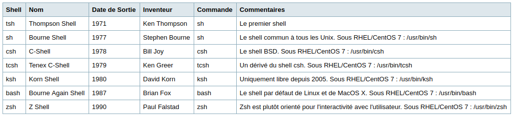
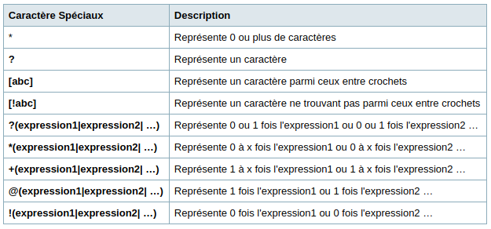

# Linux

## Ligne de Commande

### Shell

* Interpréteur de commandes ou Command Line Interpreter (C.L.I)
* Interface pour donner une commande au système
* Type de Shell : 

### Shell /bin/bash

* Shell bash permet :
	* Rappeler des commandes
	* Générer la fin de noms de fichiers
	* Utiliser des alias
	* Utiliser les variables tableaux
	* Utiliser les variables numériques et l'arithmétique du langage C
	* Gérer des chaînes de caractères
	* Utiliser les fonctions
* Commande commence par un mot-clés
* Mot-clés interprété par le shell par les types (et dans l'ordre)
	1. alias
		* nom pour une cmd ou une suite de cmd
		* Ex: `` $ alias dir='ls -l' ``
		* Lister : `` $ alias ``
		* Bypasser l'alias pour exécuter la cmd : `` $ \dir ``
		* Supprimer : `` $ unalias dir ``
	2. fonctions
	3. cmd interne au shell
	4. cmd externe au shell

#### Shell intéractif

* Caractères d'Échappement : **\\**, **' '**, **" "** (Protège pas $, \, ') 
* Code retour : **$?** (permet de stocker le caractère de retour)
* 

